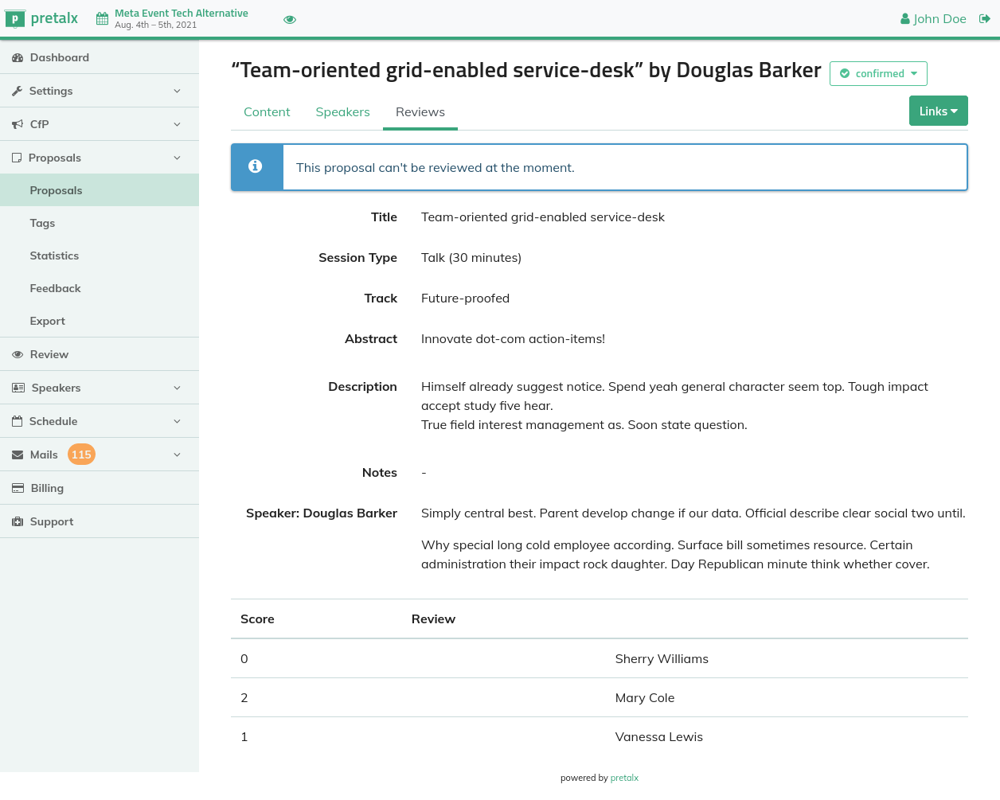

<!--
Ohart ongi: README hau automatikoki sortu da <https://github.com/YunoHost/apps/tree/master/tools/readme_generator>ri esker
EZ editatu eskuz.
-->

# Pretalx YunoHost-erako

[](https://ci-apps.yunohost.org/ci/apps/pretalx/)  

[](https://install-app.yunohost.org/?app=pretalx)

*[Irakurri README hau beste hizkuntzatan.](./ALL_README.md)*

> *Pakete honek Pretalx YunoHost zerbitzari batean azkar eta zailtasunik gabe instalatzea ahalbidetzen dizu.*  
> *YunoHost ez baduzu, kontsultatu [gida](https://yunohost.org/install) nola instalatu ikasteko.*

## Aurreikuspena

Pretalx is a conference planning tool focused on providing the best experience for organisers, speakers, reviewers, and attendees alike. It handles the submission process with a configurable Call for Participation, the reviewing and selection of submissions, and the scheduling and release handling. After the event, pretalx allows speakers to receive feedback, upload their slides, and organisers to embed recordings.

**Paketatutako bertsioa:** 2024.3.1~ynh1

**Demoa:** <https://pretalx.com/p/try>

## Pantaila-argazkiak



## Dokumentazioa eta baliabideak

- Aplikazioaren webgune ofiziala: <https://pretalx.com/>
- Administratzaileen dokumentazio ofiziala: <https://docs.pretalx.org/>
- Jatorrizko aplikazioaren kode-gordailua: <https://github.com/pretalx/pretalx>
- YunoHost Denda: <https://apps.yunohost.org/app/pretalx>
- Eman errore baten berri: <https://github.com/YunoHost-Apps/pretalx_ynh/issues>

## Garatzaileentzako informazioa

Bidali `pull request`a [`testing` abarrera](https://github.com/YunoHost-Apps/pretalx_ynh/tree/testing).

`testing` abarra probatzeko, ondorengoa egin:

```bash
sudo yunohost app install https://github.com/YunoHost-Apps/pretalx_ynh/tree/testing --debug
edo
sudo yunohost app upgrade pretalx -u https://github.com/YunoHost-Apps/pretalx_ynh/tree/testing --debug
```

**Informazio gehiago aplikazioaren paketatzeari buruz:** <https://yunohost.org/packaging_apps>
